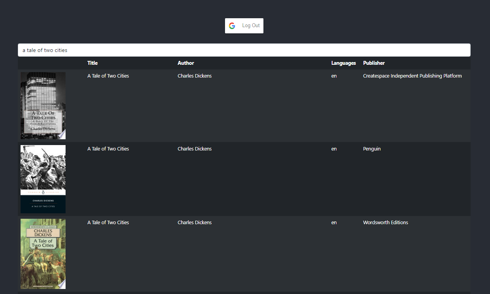

# BOOKSEARCH-UI

This is a small React project that makes use of the [Google Books API ](https://developers.google.com/books/docs/v1/using) to get a particular book using `volumeId`.

### Overview

The project has the following Routes:

- `/` - Users can sign in with Google on this page
- `/search` - Users can search a book by its title and get a list of results from the `Google books API`
- '/search/:id' - Users can retreive book details based on `id` which is unique for every book in the `Google Books API`
- `/api/history` - Users can see the history of their searches stored in the `MongoDB` database.

### Important points:

- Users need to be signed in with Google to access the `search` and `api` routes
- The queries are stored in the `MongoDB` database **once every 5 searches**

### Environment variables

`REACT_APP_GOOGLE_CLIENT_ID` - Client Id for `OAuth Authentication`

### Installing and running the app

**NOTE: This is not a standalone application, it needs an express server and a mongodb database to work**

- Clone the repo.  
  `git clone https://github.com/ag2byte/Bookserach-ui/tree.git`

- Install the dependencies:  
  `npm install`

- Run the application:  
  `npm start`

By default the application should run on `localhost:3000`

### Screenshots

Search page  

Book page  

